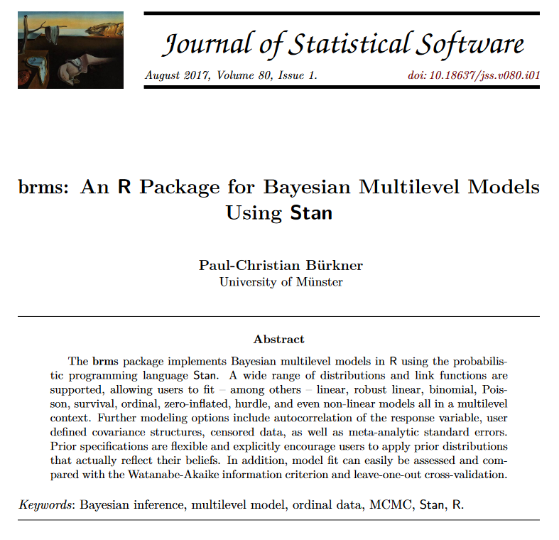

# Introduction to Bayesian Stats #2

This is a follow-up article from [Bayes#1](https://adriancorrendo.github.io/statasaurusweb/code_2_bayes_1.html). Still, we do have numerous important concepts in order to understand what the computational codes are doing behind scenes when running a Bayesian analysis.

::: callout-note
**Today's Topics**:

Computing posterior distributions:

#1. Acceptance/Rejection Sampling Basics:

#2. Markov Chain Monte Carlo (MCMC) -more efficient than AR sampling-.

Packages for Bayesian analysis in R:

#3. brms

#4. rstan

#5. rjags
:::

## Packages to use today

::: {.cell}

```{.r .cell-code}
library(latex2exp)
library(dplyr)
library(ggplot2)
library(tidyr)
library(tibble)
library(purrr)
library(brms)
library(tidybayes)
```
:::


## Computing posterior distributions:

### 1. Acceptance/Rejection Sampling Basics:

1\. Generate proposal parameter values

2\. Generate data with those parameters

3\. Compare the simulated data with the observed data = "difference"

4\. "**Accept**" that combination of parameters if the difference \< predefined acceptable error. "**Reject**" if the difference \> predefined acceptable error.

See an example:

Using data of yield vs plant density in corn:


::: {.cell}
::: {.cell-output-display}
{width=672}
:::
:::

$$ y = \beta_0 + x \cdot \beta_1 - x^2 \cdot \beta_2$$


1.  Generate proposal parameter values **using the prior ditributions**:


$$\beta_0 \sim uniform(4, 6)$$

$$\beta_1 \sim uniform(1, 3)$$

$$\beta_2 \sim uniform(0.5, 2)$$

$$\sigma \sim Gamma(2, 2)$$

::: {.cell}

```{.r .cell-code}
set.seed(567)
b0_try <- runif(1, 4, 6)  # Parameter model
b1_try <- runif(1, 1, 3)  # Parameter model 
b2_try <- rgamma(1, .5, 2) # Mathematical equation for process model
mu_try <- b0_try + x*b1_try - (x^2)*b2_try
sigma_try <- rgamma(1, 2, 2)
```
:::


2.  Generate data with those parameters\


::: {.cell}

```{.r .cell-code}
set.seed(567)
y_try <- rnorm(n, mu_try, sigma_try)  # Process model
```
:::


3.  Compare the simulated data with the observed data = "difference"


::: {.cell}

```{.r .cell-code}
# Record difference between draw of y from prior predictive distribution and
# observed data
diff[k, ] <- sum(abs(y - y_try))
```
:::


4.  "**Accept**" (gold) that combination of parameters if the difference \< predifined acceptable error. "**Reject**" (red) if the difference \> predifined acceptable error.


::: {.cell}

```{.r .cell-code}
plot(x, y, xlab = "Plant density", 
     ylab = "Observed yield", xlim = c(2, 13), ylim = c(5, 20),
     typ = "b", cex = 0.8, pch = 20, col = rgb(0.7, 0.7, 0.7, 0.9))
points(x, y_hat[k,], typ = "b", lwd = 2, 
       col = ifelse(diff[1] < error, "gold", "tomato"))
```

::: {.cell-output-display}
{width=672}
:::
:::

::: {.cell}
::: {.cell-output-display}
{width=672}
:::
:::

::: {.cell}
::: {.cell-output-display}
{width=672}
:::
:::


Now, what if whe change the priors:


::: {.cell}
::: {.cell-output-display}
{width=672}
:::
:::


Now, do many tries


::: {.cell}

```{.r .cell-code}
for (k in 1:K_tries) {
    
    b0_try <- runif(1, 2, 10)  # Parameter model
    b1_try <- rnorm(1, 2.2, .5)  # Parameter model 
    b2_try <- rgamma(1, .25, 2) # Mathematical equation for process model
    mu_try <- b0_try + x*b1_try - (x^2)*b2_try
    sigma_try <- rgamma(1, 2, 2)

    y_try <- rnorm(n, mu_try, sigma_try)  # Process model
    
    # Record difference between draw of y from prior predictive distribution and
    # observed data
    diff[k, ] <- sum(abs(y - y_try))
    
    # Save unkown random variables and parameters
    y_hat[k, ] <- y_try
    
    posterior_samp_parameters[k, ] <- c(b0_try, b1_try, b2_try, sigma_try)
}
```
:::


Acceptance rate


::: {.cell}

```{.r .cell-code}
length(which(diff < error))/K_tries
```

::: {.cell-output .cell-output-stdout}
```
[1] 0.031291
```
:::
:::


Priors versus posteriors:


::: {.cell}
::: {.cell-output-display}
{width=672}
:::
:::

::: {.cell}
::: {.cell-output-display}
{width=672}
:::
:::

::: {.cell}
::: {.cell-output-display}
{width=672}
:::
:::

::: {.cell}

```{.r .cell-code}
hist(y_hat[which(diff < error), 25], col = "grey", freq = FALSE)
abline(v = y[25], col = 'gold', lty = "dashed", lwd = 5)
```

::: {.cell-output-display}
{width=672}
:::
:::


::: {.cell}
::: {.cell-output-display}
{width=672}
:::
:::


Let's get started

## 2. Markov Chain Monte Carlo

::: {align="center"}
<iframe width="560" height="315" src="https://www.youtube.com/embed/Qqz5AJjyugM" frameborder="0" allowfullscreen>

</iframe>
:::

## 3. brms: Bayesian Regression Models using "Stan"


Documentation: <https://paul-buerkner.github.io/brms/>

Bug-reports: <https://github.com/paul-buerkner/brms/issues>

*brms* is a very handy R-package that facilitates running Bayesian models using a relatively simple syntax. It is basically and interface that runs "Stan" behind the scenes. It uses a syntax quite similar to the [lme4](https://cran.r-project.org/package=lme4) package.

It allows to use several different type of distributions and link functions for models that are linear, counts, survival, response, ordinal, zero-inflated, etc.

Due to its relatively simple syntax, today, we are going to start our Bayesian coding with brms.

More about brms at <https://www.jstatsoft.org/article/view/v080i01>

{width="336"}

### Fit brms

Let's fit the example using the brms package.

### brms pars


::: {.cell}

```{.r .cell-code}
# Set up pars
WU = 1000
IT = 5000
TH = 5
CH = 4
AD = 0.99
```
:::


### Model


::: {.cell}

```{.r .cell-code}
#| eval: false
#| echo: true

# 01. Run models

bayes_model <- 

  brms::brm(
  #Priors
  prior = c(
    #B0, Intercept
    prior(prior = 'normal(8, 8)', nlpar = 'B0', lb = 0),
    #B1, Linear Slope
    prior(prior = 'normal(2, 4)', nlpar = 'B1', lb = 0),
    #B2, Quadratic coeff
    prior(prior = 'normal(0.001, 0.5)', nlpar = 'B2', lb = 0) ),
    # Sigma  
    #prior(prior = 'gamma(15,1.3)', class = "sigma") ),  
    # Population prior (median and sd)
    
    # Formula
  formula = bf(y ~  B0 + B1 * x - B2 * (x^2),
               # Hypothesis
               B0 + B1 + B2 ~ 1,
               nl = TRUE), 
  # Data  
  data = data_frame, sample_prior = "yes",
  # Likelihood of the data
  family = gaussian(link = 'identity'),
  # brms controls
  control = list(adapt_delta = AD),
  warmup = WU, iter = IT, thin = TH,
  chains = CH, cores = CH,
  init_r = 0.1, seed = 1) 
```

::: {.cell-output .cell-output-stderr}
```
Compiling Stan program...
```
:::

::: {.cell-output .cell-output-stderr}
```
Start sampling
```
:::

```{.r .cell-code}
# 02. Save object
saveRDS(object = bayes_model, file = "bayes_model.RDS")

bayes_model <- readRDS(file = "bayes_model.RDS")

# 03. Visual Diagnostic
plot(bayes_model)
```

::: {.cell-output-display}
{width=672}
:::

```{.r .cell-code}
# Visualize model results
bayes_model
```

::: {.cell-output .cell-output-stdout}
```
 Family: gaussian 
  Links: mu = identity; sigma = identity 
Formula: y ~ B0 + B1 * x - B2 * (x^2) 
         B0 ~ 1
         B1 ~ 1
         B2 ~ 1
   Data: data_frame (Number of observations: 46) 
  Draws: 4 chains, each with iter = 5000; warmup = 1000; thin = 5;
         total post-warmup draws = 3200

Population-Level Effects: 
             Estimate Est.Error l-95% CI u-95% CI Rhat Bulk_ESS Tail_ESS
B0_Intercept     6.16      0.90     4.36     7.96 1.00     2462     2456
B1_Intercept     1.93      0.26     1.42     2.45 1.00     2386     2619
B2_Intercept     0.11      0.02     0.08     0.15 1.00     2395     2591

Family Specific Parameters: 
      Estimate Est.Error l-95% CI u-95% CI Rhat Bulk_ESS Tail_ESS
sigma     0.75      0.08     0.60     0.93 1.00     2969     2807

Draws were sampled using sampling(NUTS). For each parameter, Bulk_ESS
and Tail_ESS are effective sample size measures, and Rhat is the potential
scale reduction factor on split chains (at convergence, Rhat = 1).
```
:::

```{.r .cell-code}
# Compare vs traditional linear model (lm)
data_frame_q <- data_frame %>% mutate(x2 = x^2)

lm(data = data_frame_q, formula = y ~ x + x2)
```

::: {.cell-output .cell-output-stdout}
```

Call:
lm(formula = y ~ x + x2, data = data_frame_q)

Coefficients:
(Intercept)            x           x2  
     6.1324       1.9401      -0.1127  
```
:::
:::


### Extract posterior distributions


::: {.cell}

```{.r .cell-code}
# Create predictions
m1 <- data_frame %>% 
  ungroup() %>% 
  dplyr::select(x) %>% 
  group_by(x) %>% filter(x == max(x)) %>% 
  ungroup() %>% unique() %>% rename(max = x) %>% 
  # Generate a sequence of x values
  mutate(data = max %>% purrr::map(~data.frame(
    x = seq(0,.,length.out = 400)))) %>% 
  unnest() %>% dplyr::select(-max) %>%
  
  #add_linpred_draws(m1, re_formula = NA, n = NULL) %>% ungroup()
  # use ".linpred to summarize"
  tidybayes::add_predicted_draws(bayes_model, 
                                 re_formula = NA, ndraws = NULL) %>% ungroup()
```

::: {.cell-output .cell-output-stderr}
```
Warning: `cols` is now required when using unnest().
Please use `cols = c(data)`
```
:::

```{.r .cell-code}
# Summarize
m1_quantiles <- m1 %>% 
  group_by(x) %>% 
  summarise(q025 = quantile(.prediction,.025),
            q010 = quantile(.prediction,.10),
            q250 = quantile(.prediction,.25),
            q500 = quantile(.prediction,.500),
            q750 = quantile(.prediction,.75),
            q900 = quantile(.prediction,.90),
            q975 = quantile(.prediction,.975))

# Plot
m1_plot <- ggplot()+
  # 95%
  geom_ribbon(data = m1_quantiles, alpha=0.60, fill = "cornsilk3",
              aes(x=x, ymin=q025, ymax=q975))+
  # 80%
  geom_ribbon(data = m1_quantiles, alpha=0.25, fill = "cornsilk3",
              aes(x=x, ymin=q010, ymax=q900))+
  # 50%
  geom_ribbon(data = m1_quantiles, alpha=0.5, fill = "#8a817c",  
              aes(x=x, ymin=q250, ymax=q750))+
  geom_path(data = m1_quantiles,
            aes(x=x, y=q500, color = "brms()"), size = 1)+
  geom_point(data = data_frame, aes(x=x, y=y, color = "brms()"), alpha = 0.25)+
  # Add LM curve
  geom_smooth(data = data_frame, aes(x=x, y=y, color = "lm()"),  
              method = "lm", formula = y ~ poly(x,2), se = T)+
  scale_color_viridis_d()+
  scale_x_continuous(limits = c(0,12), breaks = seq(0,12, by = 1))+
  scale_y_continuous(limits = c(4,16), breaks = seq(4,16, by = 1))+
  #facet_wrap(~as.factor(C.YEAR), nrow = 4)+
  theme_bw()+
  theme(legend.position='right', 
        legend.title = element_blank(),
        panel.grid = element_blank(),
        axis.title = element_text(size = rel(2)),
        axis.text = element_text(size = rel(1)),
        strip.text = element_text(size = rel(1.5)),
        )+
  labs(x = "Plant density (pl/m2)", y = "Corn yield (Mg/ha)")

m1_plot
```

::: {.cell-output-display}
{width=672}
:::
:::


## 4. rstan: R interface to "Stan"

{width="190"}

Documentation: <https://mc-stan.org/rstan/>

Bug reports: <https://github.com/stan-dev/rstan/issues/>

*stan* is a stand-alone open-source software platform designed for statistical modeling using high-performance statistical computation applying its own language. When selecting the Bayesian computational approach (i.e. ***rejection sampling criteria***) there are several alternatives to choose. *Stan* produces Bayesian statistical inference following Hamiltonian Monte Carlo (HMC), and No-U-Turn Samples (NUTS). Besides R, *stan* has interfaces with other popular languages such as Python, MATLAB, Julia.

In contrast to *brms*, stan's syntax is more complicated for begginers, but the positive side is that requires us to write the statistical model.

We will not fit a model directly with stan today, but *brms* brings a function that allows users to obtain the code to run the analysis by ourselves using rstan. Let's see...

## 5. rjags: R interface to "Just Another Gibbs Sampler"

{width="318"}

Documentation: <https://mcmc-jags.sourceforge.io/>

Bug reports: <https://sourceforge.net/projects/mcmc-jags/>

*rjags* is another popular option for Bayesian statistical inference following MCMC using R. *Rjags* produces Bayesian statistical inference following BUGS language (WinBUGS). Similar to *stan*, *rjags* it is probably not for beginner, since it requires us to write out the statistical model (although it is always ideal). To extract the posteriors, it also requires [coda](https://cran.r-project.org/web/packages/coda/index.html), which is especially designed for summarizing and plotting MCMC simulations.

